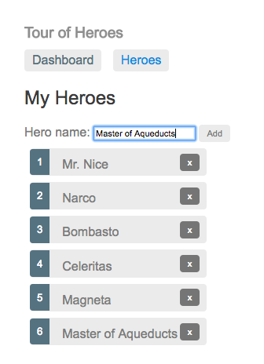

# 3. Storing Data in a Database

In the previous exercise, we loaded some heroes into the database our application reads from. Now, we will allow our application to store, delete and modify heroes in the database.

We'll add a method to our `HeroesController` to handle the `POST /heroes` operation. It will add a new row to the heroes table in our database. It will then return that hero in the response body. In `heroes_controller.dart`, add the following operation method:

```dart
@Operation.post()
Future<Response> createHero() async {
  final body = request.body.asMap();
  final query = new Query<Hero>(context)
    ..values.name = body['name'];

  final insertedHero = await query.insert(context);

  return new Response.ok(insertedHero);
}
```

From this code, we expect that the request body is:

```json
{
  "name": "Super Duper Programmer"
}
```

The use of a `Query<Hero>` is very similar to the previous chapter, except that we populate its `values` property and invoke the `insert()` execution method. Like `where`, the `values` property of a query is an instance of its generic type (`Hero`). Any property of set on `values` will be sent to the database in the insert command. The generated SQL for the above would be something like:

```sql
INSERT INTO _Hero (name) VALUES ('Hero Name');
```

We get the values for the query from the body of the request. (Recall that `request` is a property of all `RESTController` subclasses and it contains the request object currently being handled.) By invoking `asMap()` on `request.body`, we both obtain the request body as a `Map` and also ensure that the body is in fact a `Map` (otherwise, an exception would be thrown and an error response would be sent.)

!!! note "Autoincrementing Primary Keys"
    Notice that we don't include an `id` in the query - it will automatically be generated by the database. This is the default behavior when a `ManagedObject<T>` property is annotated with `@primaryKey`. See [modeling data](../db/modeling_data.md) for other options.

By default, `insert()` returns the inserted `Hero` object. This is valuable when using auto-incremented primary keys (or any auto-incremented value), because the returned `Hero` now has values for that property provided by the database. Our operation method returns this newly created `Hero` with its `id` in the response body.

## Request Bodies and Body Bindings

-----
-----
-----

!!! note "Other Content-Types"
    Aqueduct can decode JSON and form data by default. For other content types, see the [API reference for HTTPCodecRepository](https://www.dartdocs.org/documentation/aqueduct/latest/aqueduct/HTTPCodecRepository-class.html).


It is often safer and more convenient to bind the body to a parameter of our operation method, instead of manually managing `request.body`. Update `createHero()`:

```dart
@Operation.post()
Future<Response> createHero(@Bind.body() Hero inputHero) async {
  final query = new Query<Hero>(context)
    ..values = inputHero;

  final insertedHero = await query.insert(context);

  return new Response.ok(insertedHero);
}
```

Binding a request body will automatically deserialize the decoded contents of the request body into an object. That object's type must implement the interface `HTTPSerializable`, which all `ManagedObject<T>`s do. Properties of the `inputHero` will be set from the decoded request body map when the JSON key matches the name of the property. If deserializing the request body into a `Hero` instance fails for any reason, a 400 Bad Request response is sent and the operation method is not called.


An insert query creates a row in the database. The values for each column are provided through the `Query.values` property. Like `Query.where`, `Query.values` is also an instance of a `Hero` and therefore has an `id` and `name` property.

Re-run your `heroes` application. On [http://aqueduct-tutorial.stablekernel.io](http://aqueduct-tutorial.stablekernel.io), click on the `Heroes` button on the top of the screen. In the text field, enter a new hero name and click `Add`. You'll see your new hero added to the list! You can shutdown your application and run it again and you'll still be able to fetch your new hero.



!!! tip "Query Construction"
    Properties like `values` and `where` prevent errors by type and name checking columns with the analyzer. They're also great for speeding up writing code because your IDE will autocomplete property names. There is [specific behavior](../db/advanced_queries.md) a query uses to decide whether it should include a value from these two properties in the SQL it generates.
